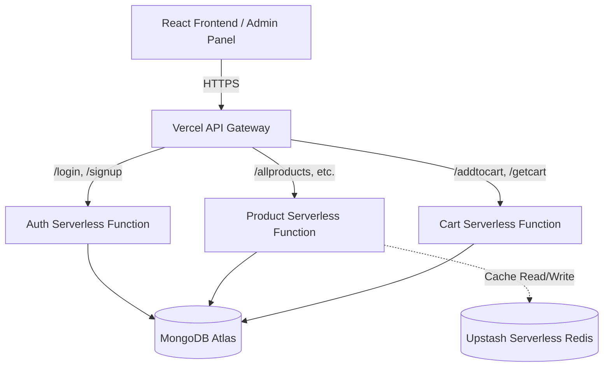

# Shoppers Stop - E-Commerce Platform

A highly scalable, modern e-commerce platform engineered with a **Serverless Microservices Architecture**. This project demonstrates advanced system design principles, decoupling a traditional Node.js monolith into specialized serverless functions, orchestrated by an API Gateway and accelerated by Edge Caching.

## 🏗 System Architecture

The backend is built on **Vercel Serverless Functions**, allowing independent scaling of the Auth, Product, and Cart domains. We utilize **Upstash Serverless Redis** to cache read-heavy database queries, drastically reducing latency and MongoDB load.

## ✨ Key Features & System Design

- **API Gateway (Edge Routing)**: Vercel's Edge Network (`vercel.json` rewrites) intercepts incoming requests and transparently routes them to the correct microservice without exposing the internal routing logic to the client.
- **Serverless Microservices**: The backend logic is decoupled into isolated `auth.js`, `cart.js`, and `product.js` functions, preventing a crash in one service from bringing down the entire platform.
- **Edge Caching via Upstash**: To handle massive read loads (like browsing product catalogs), the Product service integrates `@upstash/redis` (a REST-based serverless Redis client) to aggressively cache queries, achieving near-zero latency.
- **No-SQL Database**: MongoDB handles persistent data storage across all services.

## 🚀 Live Demo

- **Frontend Application**: [https://frontend-psi-sepia-80.vercel.app](https://frontend-psi-sepia-80.vercel.app)
- **Admin Dashboard**: [https://admin-chi-sage.vercel.app](https://admin-chi-sage.vercel.app)
- **API Gateway**: [https://backend-plum-six-81.vercel.app](https://backend-plum-six-81.vercel.app)

## 🛠 Tech Stack

- **Frontend**: React.js
- **Backend**: Node.js, Express.js (Serverless)
- **Database**: MongoDB Atlas
- **Caching**: Upstash Serverless Redis
- **Hosting**: Vercel
